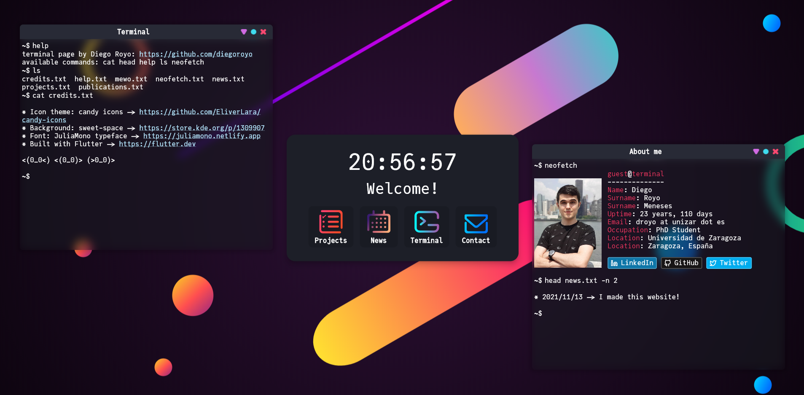

# `terminal.diego.contact`

Personal website inspired by my KDE desktop setup. Uses a (mostly functional) simulated terminal to navigate its contents.

Feel free to use it for yourself as explained in the <a href="https://github.com/diegoroyo/terminal.diego.contact/blob/master/LICENSE">license</a>. Credit is appreciated. The website's content can be edited in <a href="https://github.com/diegoroyo/terminal.diego.contact/blob/master/assets/text">`assets/text`</a> (rendered as HTML) and <a href="https://github.com/diegoroyo/terminal.diego.contact/blob/master/lib/include/cat_files.dart">`lib/include/cat_files.dart`</a> (see `FILENAME_MAP`). The commands can be found on <a href="https://github.com/diegoroyo/terminal.diego.contact/blob/master/lib/widgets/terminal/terminal.dart">`lib/widgets/terminal/terminal.dart`</a> (see `COMMAND_MAP`).

---

---
